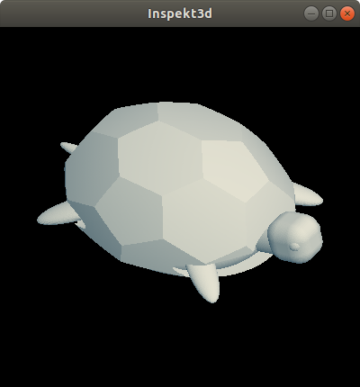

# Inspekt3d

Lightweight 3D viewer for
[Libfive](https://www.github.com/libfive/libfive) written in Guile
Scheme

The Inspekt3d viewer can be used interactively with a REPL (for example Geiser in Emacs).

## Usage

Code to display a sphere:

    (use-modules (inspekt3d viewer)
                 (libfive shapes) (libfive kernel) (libfive vec)
                 (libfive transforms) (libfive csg))

    (make-viewer)
    ;;;        shape        bounds                        resolution
    (set-shape (sphere 0.5) '((-1 . 1) (-1 . 1) (-1 . 1)) 10)

The ```make-viewer``` function creates a (singleton, for now) display
window for the libfive shape in its own thread.  The ```set-shape
shape bounds resolution``` function can be used multiple times from
the REPL to change the shape to be viewed.

This is a more complicated model:



[Turtle Model Source](./examples/turtle.scm)
